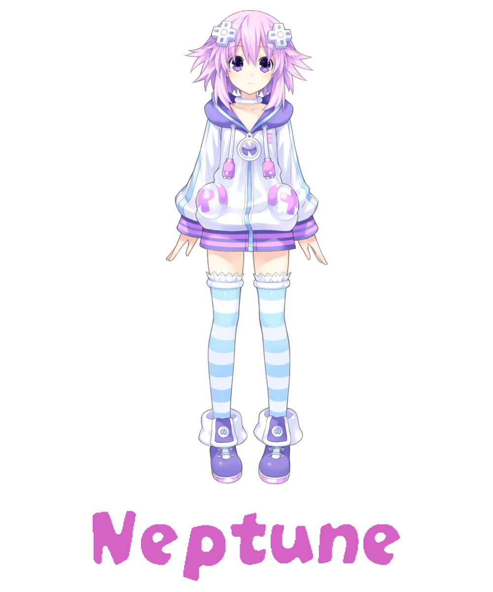

    
    

     
    
    
    
    

## The assistant application on your desktop, which pleases you with its appearance every day:)

## The application is based on:
* Python 3.1.2
* PySide6
* [live2d-py by Arkueid](https://github.com/Arkueid/live2d-py)
* Compile Heart / Idea Factory Live2D Models

## Install:
1. Clone or Download Project on your desktop
2. `python -m pip install -r requirements.txt`

## Usage:
Run:
`python package/neptune_main.py`

### Models Select:
Edit `self.models_switch = 0` parameter in package/neptune_main.py file, to the model I'd:
* Neptune = 0
* Purple Heart = 1
### Models Scale:
Edit `self.models_scale = 1` parameter in package/neptune_main.py file,  to scale model

## Models Available:

    
    

## Important to read:
#### 1. The application is at an early stage of development and may have bugs.
#### 2. The animation of the models needs to be improved
#### 3. In the next stages of development, it is planned to work on the GUI, AI assistant base on GPT model and compile the application into an .exe file
### Thanks for your attention!