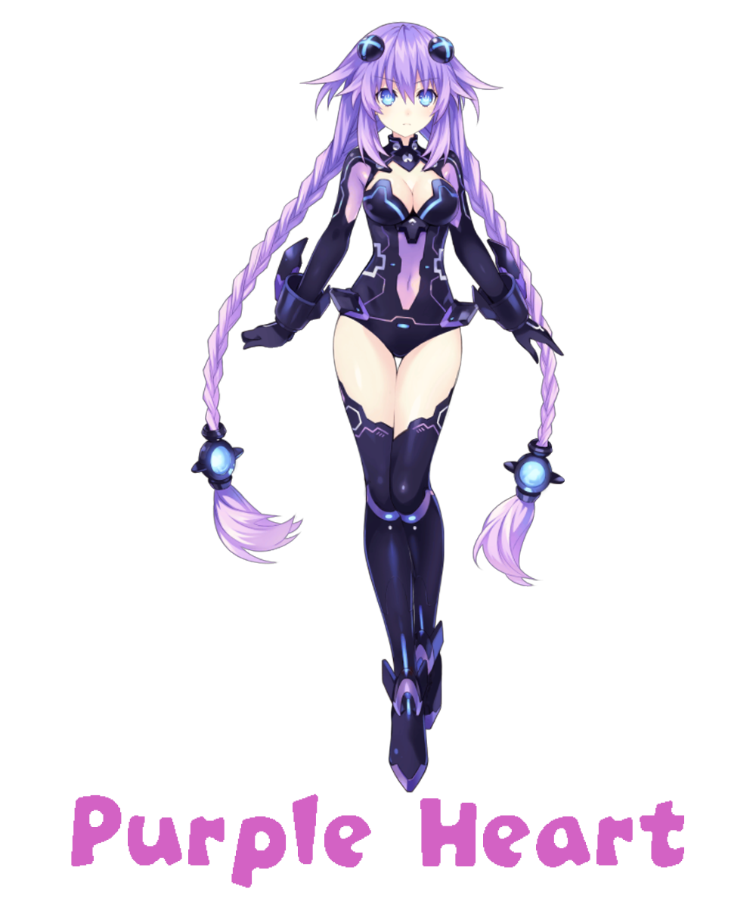

    
    

     
    
    
    
    

## The assistant application on your desktop, which pleases you with its appearance every day:)

## The application is based on:
* Python 3.12.0
* PySide6
* [live2d-py by Arkueid](https://github.com/Arkueid/live2d-py)
* Compile Heart / Idea Factory Live2D Models

## Install:
1. Clone or Download Project on your desktop
2. Install requirements `python -m pip install -r requirements.txt`

## Usage:
### Run:
`python package/neptune_main.py`

### Configuration file
The configuration file is created at the first startup, as config.ini

### Models Select:
Neptune model as default

You can change character from the context menu while the application is running

### Auto Scale:
If `auto_scale = True` parameter in config.ini file is `True`, models is scaled based on the screen size

To disable the auto-scale function, change the parameter to `False`

### Models Scale:
Edit `models_scale = 1` parameter in config.ini file, to manual scale model

### Tracking the mouse position:
Tracking the mouse position On as default

If you want Off this function as default:

Change this parameter from the context menu while the application is running.

### Logs:
If you want, you can enable logging to the console, Edit parameter to `True`.
 * l2d-py Main Log: `live2d.setLogEnable(False)`
 * l2d-py Area Log: `self.l2d_area_log = False`
 * Mouse Click Log: `self.mouse_click_log = False`
 * Mouse Tracking Log: `self.mouse_tracking_log = False`
 * Timer Diagnostic Log: `self.timer_log = False`

## Models Available:

    
    

    
    

    
    

    

## Important to read:

    

#### 1. The application is at an early stage of development and may have bugs.
#### 2. The animations need to be improved
#### 3. In the next stages of development, it is planned to work on the GUI, AI assistant base on GPT model and compile the application into an .exe file
### Please specify me, when using my code in your projects
## Thanks for your attention!
